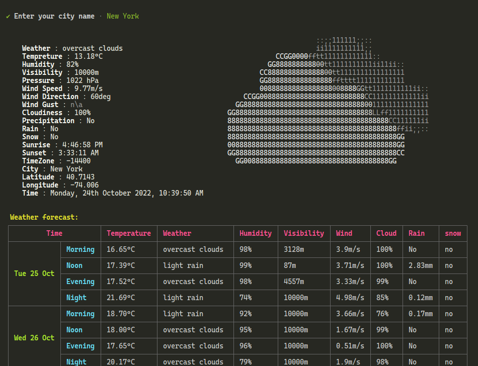

<div id="top"></div>
<div align="center">
  <h2>Wettr</h2>
  <p><i>Easy way to check Weather via the command line</i></p>
  
  
  
  <br>
  
  
  <br />
  <a href="https://github.com/devxprite/wettr/issues">Report Bug</a>
  ·
  <a href="https://github.com/devxprite/wettr/issues">Request Feature</a> <br /><br />
</div>

## ScreenShot


## Installation

### Using npx

```bash
npx wettr
```

### Using npm

```bash
npm install -g -s wettr
```

### Uninstall

```bash
npm remove wettr -g
```

## Usage

```dotnetcli
$ wettr

✔ Enter your city name · New York

                                                                     ii11111111111111;;                   
    Weather : mist                                                   ;;;;;;;;;;;;;;;;::                   
    Tempreture : 13.08°C                                   ::::::::::::::::::::::::::::::                 
    Humidity : 84%                                       ;;111111111111111111111111111111                 
    Visibility : 6437m                                   ::;;;;;;;;;;;;;;;;;;;;;;;;;;;;;;                 
    Pressure : 1022 hPa                                            :::::::::::::::::::::::::::::::::::::: 
    Wind Speed : 9.77m/s                                           ;;111111111111111111111111111111111111 
    Wind Direction : 60deg                                         ::;;;;;;;;;;;;;;;;;;;;;;;;;;;;;;;;;;;; 
    Wind Gust : n\a                                    ::::::::::::::::::::::::::::::::::::::             
    Cloudiness : 100%                                  111111111111111111111111111111111111;;             
    Precipitation : No                                 ::::::::::::::::::::::::::::::::::::::             
    Rain : No                                                ::;;;;;;;;;;;;;;;;;;;;;;;;;;;;;;;;;;;;::     
    Snow : No                                                ::111111111111111111111111111111111111::     
    Sunrise : 4:46:58 PM                                       ::::::::::::::::::::::::::::::::::::       
    Sunset : 3:33:11 AM                                            ::;;;;;;;;;;;;;;;;;;;;;;::             
    TimeZone : -14400                                              ;;1111111111111111111111;;             
    City : New York                                                                                       
    Latitude : 40.7143                                                                                    
    Longitude : -74.006                                                                                   
    Time : Monday, 24th October 2022, 11:00:00 AM                                                         


 Weather forecast:
┌──────────────────────┬─────────────┬──────────────────┬──────────┬────────────┬─────────┬───────┬────────┬──────┐
│         Time         │ Temperature │ Weather          │ Humidity │ Visibility │ Wind    │ Cloud │ Rain   │ snow │
├────────────┬─────────┼─────────────┼──────────────────┼──────────┼────────────┼─────────┼───────┼────────┼──────┤
│            │ Morning │ 16.65°C     │ overcast clouds  │ 98%      │ 3128m      │ 3.9m/s  │ 100%  │ No     │ no   │
│            ├─────────┼─────────────┼──────────────────┼──────────┼────────────┼─────────┼───────┼────────┼──────┤
│            │ Noon    │ 17.39°C     │ light rain       │ 99%      │ 87m        │ 3.71m/s │ 100%  │ 2.83mm │ no   │
│ Tue 25 Oct ├─────────┼─────────────┼──────────────────┼──────────┼────────────┼─────────┼───────┼────────┼──────┤
│            │ Evening │ 17.52°C     │ overcast clouds  │ 98%      │ 4557m      │ 3.33m/s │ 99%   │ No     │ no   │
│            ├─────────┼─────────────┼──────────────────┼──────────┼────────────┼─────────┼───────┼────────┼──────┤
│            │ Night   │ 21.69°C     │ light rain       │ 74%      │ 10000m     │ 4.98m/s │ 85%   │ 0.12mm │ no   │
├────────────┼─────────┼─────────────┼──────────────────┼──────────┼────────────┼─────────┼───────┼────────┼──────┤
│            │ Morning │ 18.70°C     │ light rain       │ 92%      │ 10000m     │ 3.66m/s │ 76%   │ 0.17mm │ no   │
│            ├─────────┼─────────────┼──────────────────┼──────────┼────────────┼─────────┼───────┼────────┼──────┤
│            │ Noon    │ 18.00°C     │ overcast clouds  │ 95%      │ 10000m     │ 1.67m/s │ 99%   │ No     │ no   │
│ Wed 26 Oct ├─────────┼─────────────┼──────────────────┼──────────┼────────────┼─────────┼───────┼────────┼──────┤
│            │ Evening │ 17.65°C     │ overcast clouds  │ 96%      │ 10000m     │ 0.51m/s │ 100%  │ No     │ no   │
│            ├─────────┼─────────────┼──────────────────┼──────────┼────────────┼─────────┼───────┼────────┼──────┤
│            │ Night   │ 20.17°C     │ overcast clouds  │ 79%      │ 10000m     │ 1.9m/s  │ 98%   │ No     │ no   │
├────────────┼─────────┼─────────────┼──────────────────┼──────────┼────────────┼─────────┼───────┼────────┼──────┤
│            │ Morning │ 19.11°C     │ light rain       │ 82%      │ 10000m     │ 2.58m/s │ 88%   │ 0.17mm │ no   │
│            ├─────────┼─────────────┼──────────────────┼──────────┼────────────┼─────────┼───────┼────────┼──────┤
│            │ Noon    │ 17.04°C     │ broken clouds    │ 68%      │ 10000m     │ 4.35m/s │ 52%   │ No     │ no   │
│ Thu 27 Oct ├─────────┼─────────────┼──────────────────┼──────────┼────────────┼─────────┼───────┼────────┼──────┤
│            │ Evening │ 14.73°C     │ clear sky        │ 69%      │ 10000m     │ 6.06m/s │ No    │ No     │ no   │
│            ├─────────┼─────────────┼──────────────────┼──────────┼────────────┼─────────┼───────┼────────┼──────┤
│            │ Night   │ 18.37°C     │ scattered clouds │ 49%      │ 10000m     │ 4.84m/s │ 26%   │ No     │ no   │
├────────────┼─────────┼─────────────┼──────────────────┼──────────┼────────────┼─────────┼───────┼────────┼──────┤
│            │ Morning │ 15.51°C     │ few clouds       │ 41%      │ 10000m     │ 5.95m/s │ 12%   │ No     │ no   │
│            ├─────────┼─────────────┼──────────────────┼──────────┼────────────┼─────────┼───────┼────────┼──────┤
│            │ Noon    │ 11.58°C     │ clear sky        │ 51%      │ 10000m     │ 5.32m/s │ No    │ No     │ no   │
│ Fri 28 Oct ├─────────┼─────────────┼──────────────────┼──────────┼────────────┼─────────┼───────┼────────┼──────┤
│            │ Evening │ 10.36°C     │ clear sky        │ 59%      │ 10000m     │ 5.05m/s │ 8%    │ No     │ no   │
│            ├─────────┼─────────────┼──────────────────┼──────────┼────────────┼─────────┼───────┼────────┼──────┤
│            │ Night   │ 14.53°C     │ broken clouds    │ 52%      │ 10000m     │ 5.33m/s │ 79%   │ No     │ no   │
└────────────┴─────────┴─────────────┴──────────────────┴──────────┴────────────┴─────────┴───────┴────────┴──────┘
```